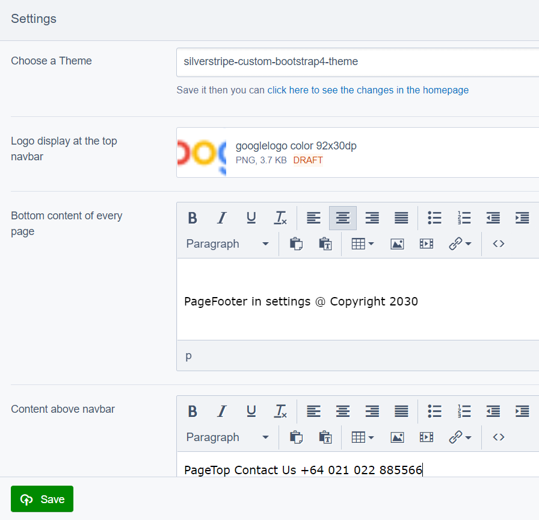
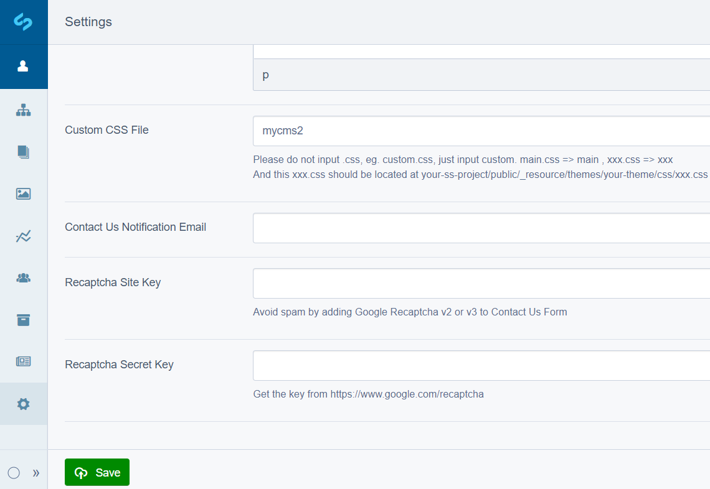

# SilverStripe All-in-one

- SilverStripe All-in-one for start a new website. You can build a basic website within 30 minutes after installed.
- [Bootstrap 4 themes included](https://github.com/AlexStack/silverstripe-custom-bootstrap4-theme#readme)
- [Contact Us Form included](https://github.com/AlexStack/SilverStripe-Custom-Layout-Page-with-Contact-Us-Form#readme)
- [Custom Carousel Slider included](https://github.com/AlexStack/SilverStripe-Custom-Carousel-Slider#readme)
- Change themes in the settings from the admin without touch the themes.yml file
- Easy to custom page top logo, copyright content at the bottom of every page, page content above nav bar, reserved fields for extension, custom css file

## How to install

```php
composer require alexstack/silverstripe-all-in-one
```

## Global settings in the admin
- Rebuild the database by /dev/build?flush=1 then visit the /admin/?flush=1



## Start a new SilverStripe website/project

```bash
    cd your-website-root-folder
    composer create-project silverstripe/installer ./silverstripe
    ln -s silverstripe/public public
    // Go to the browser install SilverStripe first
    cd silverstripe/
    composer require alexstack/silverstripe-all-in-one
```

## License

- BSD-3-Clause

